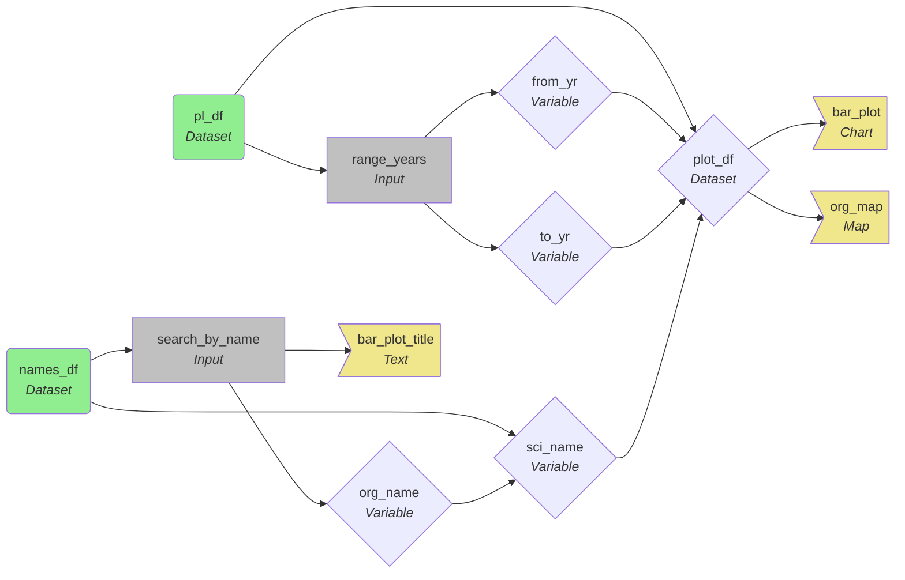
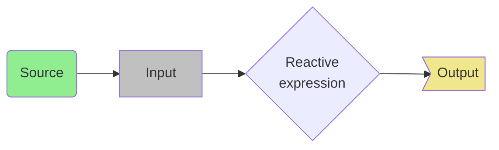

# Biodiversity Observations in Poland

Current (temporary) location: https://castagnetto.net (until 2022-08-13)

Alternate (permanent) location: https://jesuscastagnetto.shinyapps.io/gbif-pl-dashboard/


## Description

This dashboard allows anyone to explore the observation occurrences, in Poland, of diverse animals, plants and fungi.

You can select the desired organism using either its scientific or common (*vernacular*) name, and then showing the yearly distribution of observed individual, as well as the observation location on a map. There is also the capability of restricting observations to a specific range of years.

Each marker in the map displays a label on mouse over, and a short description of the observation (including an image, when available).

## Source of information

### Organism observations/occurrences

The data was originally obtained from the [Global Biodiversity Information Facility](https://www.gbif.org/what-is-gbif), by extracting all organism observations from Poland (until 2022-07-21)

- GBIF.org (21 July 2022) GBIF Occurrence Download https://doi.org/10.15468/dl.73kjer

The data contains 59,160 occurrences, including metadata in Darwin Core format, and is Licensed under [CC BY-NC 4.0](http://creativecommons.org/licenses/by-nc/4.0/legalcode)

### Images

The images of the organisms used in the visualization, are obtained from the GBIF metadata linking to [Observation.org](https://observation.org/), which is the "*... largest nature platform in the Netherlands and part of the Observation International Foundation ...*" (from "[Observation.org > About Us > Mission](https://observation.org/pages/mission/)"), and bear the copyright of their respective authors.

- *Note*: The image URLs in the GBIF metadata (*vide supra*) might not include all the images that exist in the actual full reports. Only 7,746 reports have at least one image in the metadata (~13% of entries).

For those observations without an image in the GBIF metadata, I have used the Wikimedia Commons image at https://commons.wikimedia.org/wiki/File:No_Image_Available.jpg (Col pr, CC BY-SA 4.0 <https://creativecommons.org/licenses/by-sa/4.0>, via Wikimedia Commons)

## Shiny application

### Pre-processing of the data

In order to have a clean dataset for the visualization, I've decided to download the data up to a given date (2022-07-21) and do some pre-processing to have it ready for display in a dashboard.

From the downloaded ZIP file (selecting the one containing the Darwin Core metadata), I've used two files:

- `multimedia.txt`: contains a list of the images associated with each observation
  - From this data, I've selected the `gbifID` and `identifier` columns, which contain (respectively), the GBIF ID and the URL for the image associated to that observation. The `identifier` column was renamed to `img_url`, and then for each observation, only the first image (after ordering by URL) was picked.

- `occurrence.txt`: contains the records of each observation in Poland
  - From this data, I've selected the columns: `gbifID`, `identifier`,
    `occurrenceID`, `eventDate`, `year`, `month`, `day`,
    `individualCount`, `countryCode`, `locality`,
    `decimalLatitude`, `decimalLongitude`,
    `kingdom`, `vernacularName`, and `scientificName`

It was noted that, in the occurrence data, any given scientific name can have one or more common (*vernacular*) names, so, in order to standardize the nomenclature, I've collapsed all common names of a given scientific name into a string, using the "pipe" character (" | ") as separator. A new column (`org_name`) was composed using the pattern `scientificName / vernacularName`, which would allow for free text search by either type of name.

Also, the occurrence data was augmented with the `img_url` column, and appropriate columns for use with marker labels (`str_lbl`) and pop-ups (`popup_lbl`) were generated using the other existing fields.

There is a shell script (`prepare-app-data.sh`) that executes the appropriate R code (in `preproc-data.R`), which generates two datasets:

- `data/pl_data.rds`: the selected observations for Poland
- `data/species_names.rds`: an equivalency table between scientific and common names for the organisms.

### Organization of the application

The Shiny app is composed of three main files:

- `global.R`: loads the appropriate libraries, datasets and prepares some global variables
- `ui.R`: defines the overall dashboard structure
  - This makes use of the `gbifUI()` function defined in the module `R/mod_gbif.R`
    - The UI includes:
      - A Selectize-based search widget that allows for free text search and selection
      - A range slider that can be used to filter by a given year range
      - A bar plot showing the number of individuals observed per year
      - A map showing the locations of the observations, clustering nearby observations so as to not clutter the visualization.
        - The map has, by default, `CartoDB.Positron` tiles which are a bit subdued, with the possibility of selecting a more detailed set of tiles: `OpenStreetMap`
        - Also, the map is purposedly limiting the zoom to level 6, which is about country level, to avoid users zooming out too far.
  - On the sidebar there are three tabs/sections:
    - The dashboard visualization
    - A short "about" page
    - Information about the sources of the data and images.
- `server.R`: the processing logic for the Application
  - This makes use of the `gbifServer()` function defined in the module `R/mod_gbif.R`
    - The aforementioned function, takes care of:
      - Updating the list of options used in the Selectize-based widget
      - Obtaining the appropriate input values
      - In response to the input, updating the bar plot and the markers in the map

The plotting functions used by the module mentioned above, are defined in `R/barplot_by_sciname.R` and `R/plot_org_map.R`

### Reactive graph of the application (simplified)

Below is a simplified view of the several reactive pieces used in this visualization (generated using the [Mermaid](https://mermaid-js.github.io/mermaid/) diagram language)



Legend:



### Unit tests of the code

I've used `testthat` (not in package mode) to test for the succesful creation of a `plotly` (bar plot) and `leaflet` (map) objects, including checking that they contain data.

The script used to run the tests is: `run-tests.R` and the indiviual tests are in `tests/test-barplot_by_sciname.R` and `test-plot_org_map.R`


## Application deployment (Infrastructure Skill)

### Provisioning of an AWS EC2 instance

I decided to deploy the application on an EC2 instance on AWS, with the followng characteristics:

  - Instance type: t2.micro
  - Instance storage: 12 GB SSD
  - OS: Ubuntu 22.04LTS
  - Open incoming ports: 22, 80, 3838
  - Key: generated key pair (for SSH)
  - Dinamically assigned public IP (A.B.C.D)

Once the instance was up and running, I performed an upgrade of the installed system, and installed `byobu`. Finally I set `byobu` (a teminal multiplexer) to start on login:

```
$ sudo apt update
$ sudo apt upgrade
$ sudo apt install byobu
$ byobu-enable
```

After this, I restarted the instance, and made note of the new assigned IP and name, which will be used in the rest of the configuration.

### Installation of R and R packages

For installation of R and the needed packages, I used Dirk Eddelbuettel's `r2u` project (https://github.com/eddelbuettel/r2u), which makes it simpler to install R and packages (including upgrades), even in small server instances like the one I am using.

Below is a simplified version of the process:

```sh
$ sudo apt install r-base wget
$ wget https://github.com/eddelbuettel/r2u/raw/master/inst/scripts/add_cranapt_jammy.sh
$ chmod +x add_cranapt_jammy.sh
$ ./add_cranapt_jammy.sh
$ sudo apt update
$ sudo apt upgrade
$ sudo su

# R
> install.packages(c("tidyverse", "leaflet", "glue", "scales", "leaflet", "plotly", "shiny", "shinydashboard", "shinydashboardPlus"))
> q()
# exit

```

### Installation of the shiny server

I use the Open Source version of the RStudio Shiny Server

```
$ sudo apt install gdebi-core
$ wget https://download3.rstudio.org/ubuntu-18.04/x86_64/shiny-server-1.5.18.987-amd64.deb
$ sudo gdebi shiny-server-1.5.18.987-amd64.deb
```

After this step, I verified that the Shiny server was running on port `3838`, by going to `http://A.B.C.D:3838` (where `A.B.C.D` is the AWS dinamically assigned IP)

I planned to put the code for the Shiny App in `/srv/shiny-server/biodiversity-dashboard/`

### Installation and configuration of Nginx

I decided to use nginx for reverse-proxying the Shiny server:

**Installation**

```
$ sudo apt install nginx
```

**Configuration**

(a) Set Websocket reverse proxy support: `/etc/nginx/nginx.conf`

```
...
        # Connection for WebSocket reverse proxy
        map $http_upgrade $connection_upgrade {
                default upgrade;
                ''      close;
        }
...
```

(b) Default site: `/etc/nginx/sites-enabled/default`

```
server {
    # listen 80 means the Nginx server listens on the 80 port.
    listen 80;
    listen [::]:80;
    server_name ec2-A-B-C-D.compute-1.amazonaws.com;
    location / {
        proxy_pass http://localhost:3838/biodiversity-dashboard/;
        proxy_redirect http://localhost:3838/ $scheme://$host/;
        proxy_http_version 1.1;
        proxy_set_header Upgrade $http_upgrade;
        proxy_set_header Connection $connection_upgrade;
        proxy_read_timeout 20d;
        proxy_buffering off;
    }
}
```

### Deploying the code

I've created two scripts:

- A local one (`deploy-app.sh`) which packs all the relevant assets into a ZIP file, then copies the resulting archive (using scp) to the AWS instance, and finally opens an ssh session to the server.

- Another script in the server (`deploy.sh`) that I can run manually, that:
  - Unzips the archive in the corresponding path (`/srv/shiny-server/biodiversity-dashboard/`)
  - Restarts the Shiny server
  - Restarts Nginx

This repository contains a template for one of the scripts [`deploy-app.sh_template`](deploy-app.sh_template), which needs to be edited to include the appropriate credentials and server IP/name.

The script [`deploy.sh`](for_server/deploy.sh) is also included for simplicity.

### Assigning a domain to the biodiversity dashboard

I made use of one of my domains (`castagnetto.net`), and CloudFlare to give a nicer name to the AWS server instance:

- Assigned the CloudFlare DNS servers for the domain
- In CloudFlare
  - Mapped using CNAME castagnetto.net -> ec2-A-B-D-D.compute-1.amazonaws.com
  - Set to:
    - Use flexlible SSL/TLS (between browser and CloudFlare)
    - Always use HTTPS
    - Perform automatic HTTPS rewrites
    - Auto minify JS, CSS, HTML
    - Use brotli compression

## Possible future enhancements

Here are some enhancements/ideas to improve this visualization

- Add a way of filtering observations by the number of individuals observed: This could help people interested in, for example, migratory birds that might be observed in medium to large groups vs the occasional single individual observations.

- Normalize the scientific names: Usually the organism names follow the pattern "{species/variety name} ({taxonomist}, {year})", but some of the names in the dataset lack parentheses or do not follow fully this pattern.

- Use region selections in the bar plot to filter for observations in the map: This will simplify the visualization and will no longer require the use of a range slider selector.

- Store the whole dataset (currently ~70GB uncompressed) into a format allowing easy retrieval of data by country:
  - It could be done using a set of (`arrow`) parquet files partitioned by country and stored in S3, which could have undergone some simplification, normalization and augmentation to be ready for use in the visualization.
  - It will require adding a way of selecting a country, and then programatically loading the data on demand.
  - *Note*: tried to do something along these lines, but I gathered it will take more time (and money) than I have budgeted for this visualization, to set up something like that on AWS.
